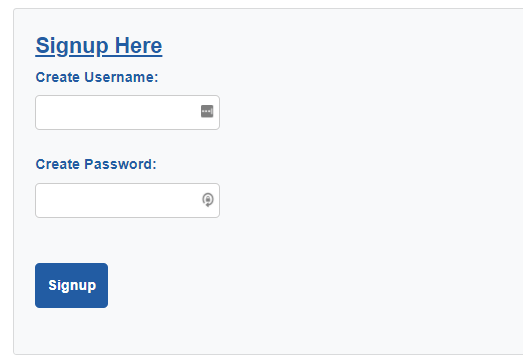

  # Tech Blog

  

  ## Description 

  This is a CMS-style blog site to publish articles, blog posts, and thoughts and opinions about all things tech!
  
  ## Table of Contents
    
  * [Installation](#installation)
  * [Usage](#usage)
  * [License](#license)
  * [Tests](#tests)
  * [Questions](#questions)
  
  ## Installation

    The following dependencies are required if you want to use this on localhost:3001:

    * You will need to have Node.js installed on your computer. 
        * You can add Node.js by going to its website at https://nodejs.org/en/ and downloading the current version. 

    * In the program itself you will need to add the following packages from npm: 
        * mysql2
        * sequelize
        * dotenv 
        * bcrypt
        * connect-session-sequelize
        * express
        * express-handlebars
        * express-session  
  
  ## Usage 
  
  This is a Tech Blog were you can publish articles, blog posts and share your thoughts and opinions about all things tech!  

  When you go to the website you are greated by the home page that has community posts and comments. 

  

  You can view the blogs and the comments without logging in. 
  
  
  
  If you want to post information or add comments you will need to log in. The nav menu will redirect you to login or signup. 

  Nav menu:

  

  Login page:

  

  Signup page:

  

  To create and view your own posts you will need to select dashboard in the nav menu. 

  

  You can update or delete your posts by selecting edit posts when in the dashboard. 

  

  You can comment on others posts when you are logged in by going to the homepage and clicking on the comments link. 

  

  When you are ready to logout, just click on the logout link in the nav bar. 

  ## License
  
  MIT

  ## Tests
  
  You can test the deployed application at the following website: https://intense-bastion-59214.herokuapp.com/ 

  ## Questions
  For questions you can contact me here:
  * GitHub Username: https://github.com/siwel20/
  * email: plthrock@gmail.com